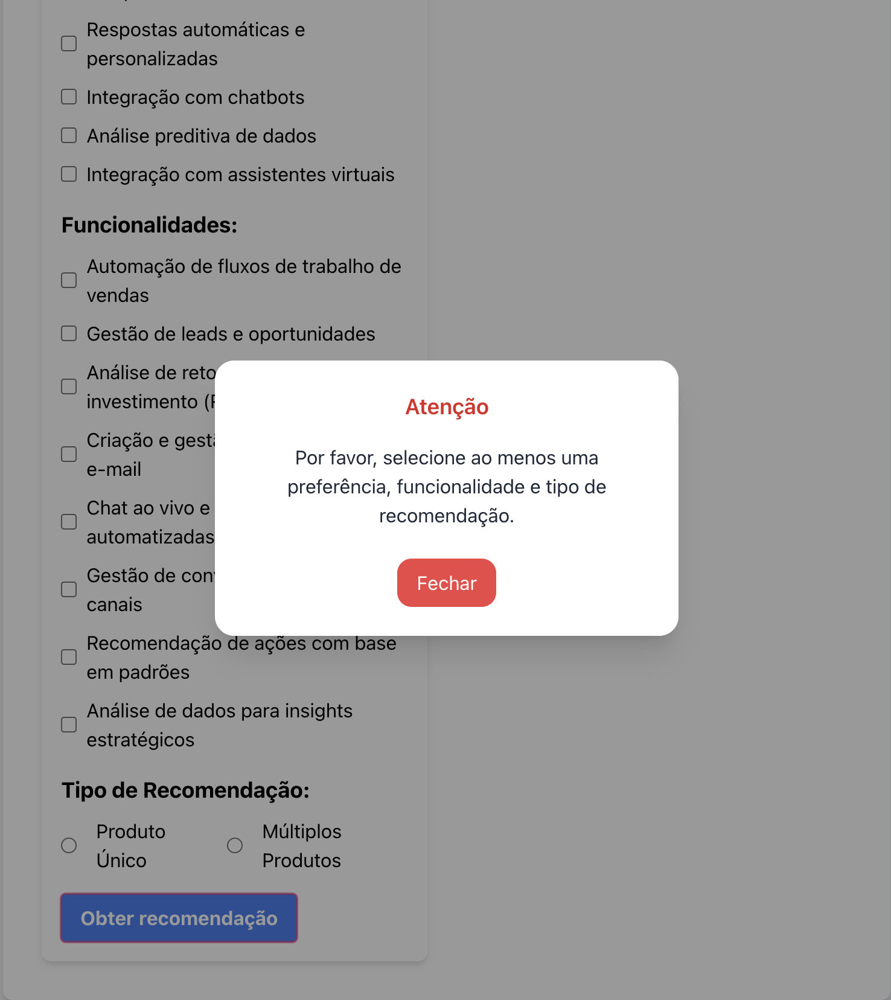

# Recomendador de Produtos RD Station

## Contexto

Este projeto é uma aplicação em **React** com **TailwindCSS**, que tem como objetivo recomendar produtos de acordo com preferências e funcionalidades selecionadas pelo usuário em um formulário.
A lógica de recomendação foi implementada no service `recommendation.service.js`.

---

## Versões

- [React](https://reactjs.org/) — `^18.2.0`
- [TailwindCSS](https://tailwindcss.com/) — `^3.4.1`
- [Node.js](https://nodejs.org/) — **18.3 ou superior**

---

## Serviço de Recomendações (`recommendation.service.js`)

A lógica implementada calcula um **score** para cada produto com base em:

- Preferências selecionadas (`selectedPreferences`)
- Funcionalidades selecionadas (`selectedFeatures`)
- Tipo de Recomendação (`selectedRecommendationType`)

### Funcionamento:

- Cada match entre preferência/funcionalidade e produto gera **1 ponto** ao score.
- O serviço retorna recomendações de acordo com o tipo selecionado no formulário:
  - **SingleProduct** → retorna apenas o produto com maior score.
    - Em caso de **empate**, retorna **o último produto válido encontrado**.
  - **MultipleProducts** → retorna todos os produtos com score > 0, **ordenados por score** (maior > menor).

---

## ⚠️ Popup de Validação do Formulário

Foi implementado um **componente de Popup** para exibir um alerta quando o formulário não está válido.

## 

## Testes (`recommendation.service.test.js`)

Testes unitários para validar a lógica do serviço de recomendações.  
Os casos de teste incluem:

1. **SingleProduct com base em preferências**

   - Deve retornar apenas 1 produto, o mais relevante para o usuário.

2. **MultipleProducts com base em preferências**

   - Deve retornar múltiplos produtos ordenados por score.

3. **Empate no SingleProduct**

   - Em caso de empate, deve retornar **o último produto válido**.

4. **Nenhum produto disponível**

   - Se a lista de produtos for vazia, deve retornar um array vazio.

5. **Nenhuma preferência/feature selecionada**
   - Deve retornar um array vazio, pois não há critérios para recomendação.

---

## Como Rodar o Projeto

1. Clone o repositório: `git clone <URL_DO_REPOSITORIO>`
2. Instale as dependências: `yarn install`
3. Para instalar o projeto, execute o script `./install.sh`
4. Inicie a aplicação: `yarn start`

### Scripts Disponíveis

- `start`: Inicia a aplicação React em modo de desenvolvimento.
- `start:frontend`: Inicia apenas a parte frontend da aplicação em modo de desenvolvimento.
- `start:backend`: Inicia apenas a parte backend da aplicação em modo de desenvolvimento.
- `dev`: Inicia simultaneamente a parte frontend e backend da aplicação em modo de desenvolvimento.
